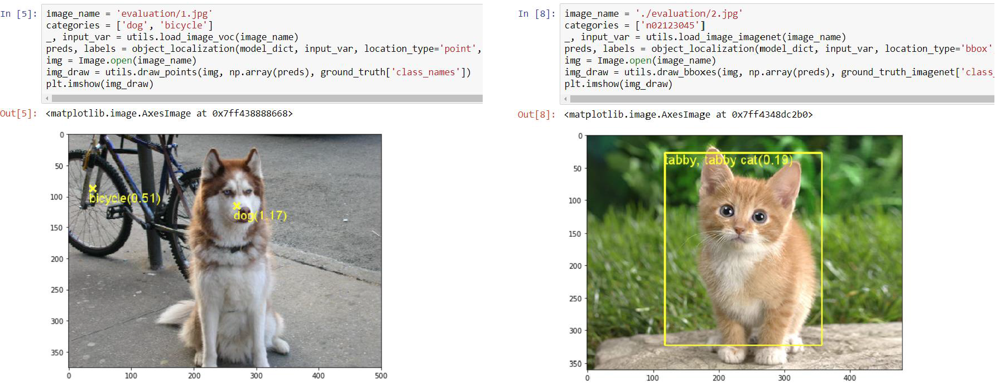

# PyTorch implementation of SPN

Soft Proposal Networks for Weakly Supervised Object Localization, ICCV 2017.

[[Project Page]](http://yzhu.work/spn) [[Paper]](https://arxiv.org/pdf/1709.01829) [[Supp]](http://yzhu.work/pdffiles/SPN_Supp.pdf) 

[[Torch code]](https://github.com/ZhouYanzhao/SPN)  

## Requirements
[Conda virtual environment](https://conda.io/docs/user-guide/tasks/manage-environments.html) is recommended: `conda env create -f environment.yml`

* Python3.5
* PyTorch: `conda install pytorch torchvision -c soumith`
* Packages: torch, [torchnet](https://github.com/pytorch/tnt), numpy, tqdm 

## Usage
1. Clone the SPN repository: 
    ```bash
    git clone https://github.com/yeezhu/SPN.pytorch.git
    ```
2. Download the backbone model [VGG16](http://drive.google.com/uc?id=0B9P1L--7Wd2vLTJZMXpIRkVVRFk) (exported from caffe model) and then the model path should be `SPN.pytorch/demo/models/VGG16_ImageNet.pt`.

3. Install SPN: 
    ```bash
    cd SPN.pytorch/spnlib
    bash make.sh
    ```

4. Run the training demo: 
    ```bash
    cd SPN.pytorch/demo
    bash runme.sh
    ```

5. Run the testing demo: [EvaluationDemo.ipynb](demo/EvaluationDemo.ipynb)
    
    Note: To perform bbox localization on ImageNet, firstly download the [SP_GoogleNet_ImageNet](https://1drv.ms/u/s!AvBFM3T6JM8WhmRqYC3nyBeagbsJ) model and the [annotations](http://www.image-net.org/challenges/LSVRC/2012/nnoupb/ILSVRC2012_bbox_val_v3.tgz) into `imagenet_eval` folder. Extraxt the annotations:
    ```bash
    cd SPN.pytorch/demo/evaluation/imagenet_eval
    tar zxvf ILSVRC2012_bbox_val_v3.tgz    
    ```

## Citation 
If you use the code in your research, please cite:
```bibtex
@INPROCEEDINGS{Zhu2017SPN,
    author = {Zhu, Yi and Zhou, Yanzhao and Ye, Qixiang and Qiu, Qiang and Jiao, Jianbin},
    title = {Soft Proposal Networks for Weakly Supervised Object Localization},
    booktitle = {ICCV},
    year = {2017}
}
```

## Acknowledgement
In this project, we reimplemented SPN on PyTorch based on [wildcat.pytorch](https://github.com/durandtibo/wildcat.pytorch). To keep consistency with the Torch version, we use the VGG16 model exported from caffe in [fcn.pytorch](https://github.com/wkentaro/pytorch-fcn).
